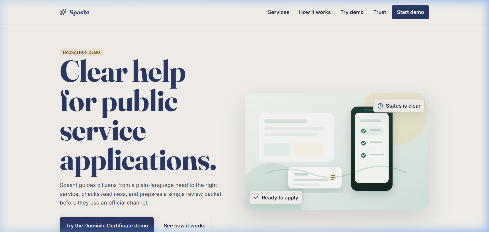
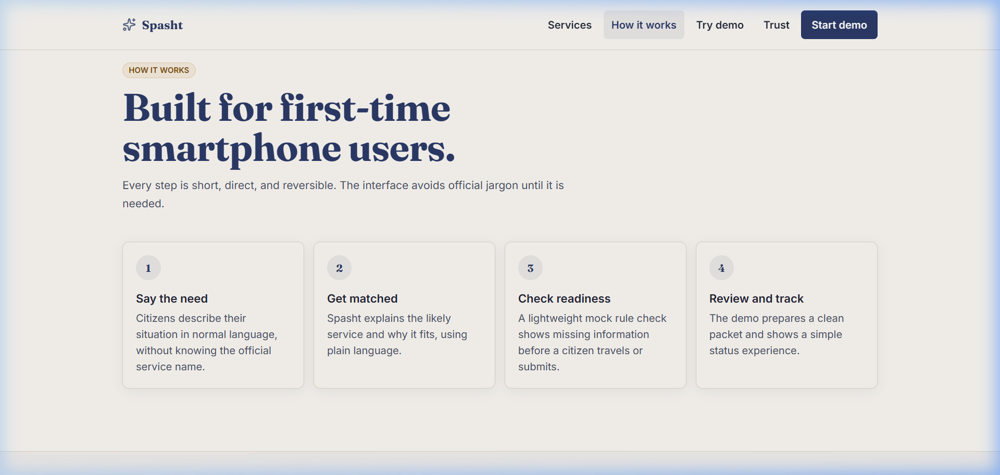
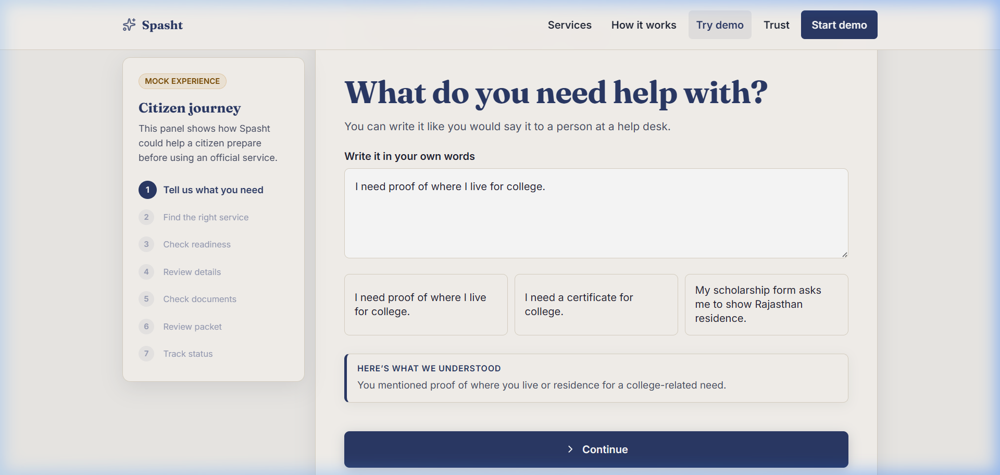
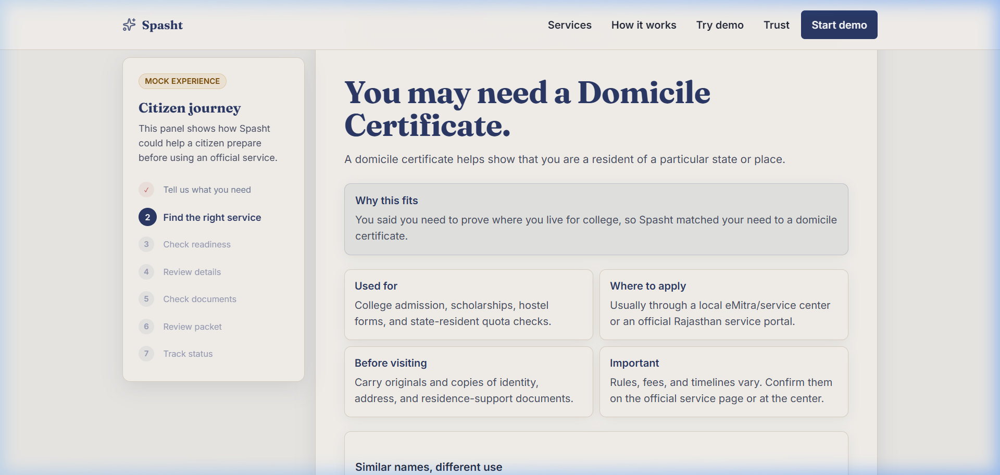
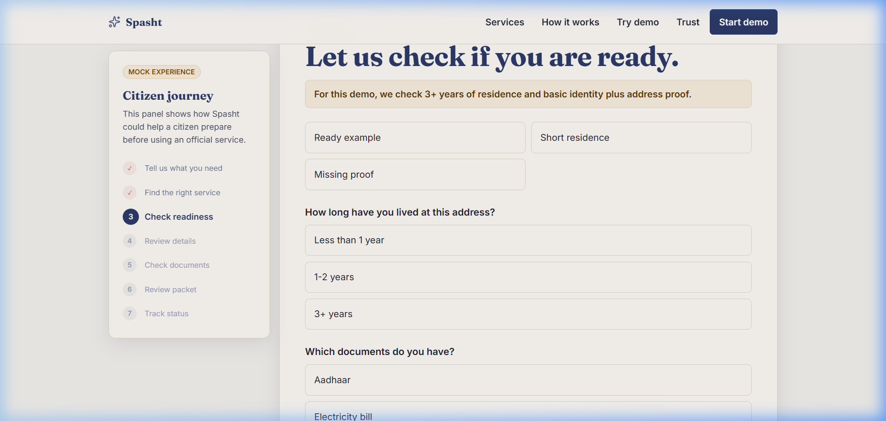
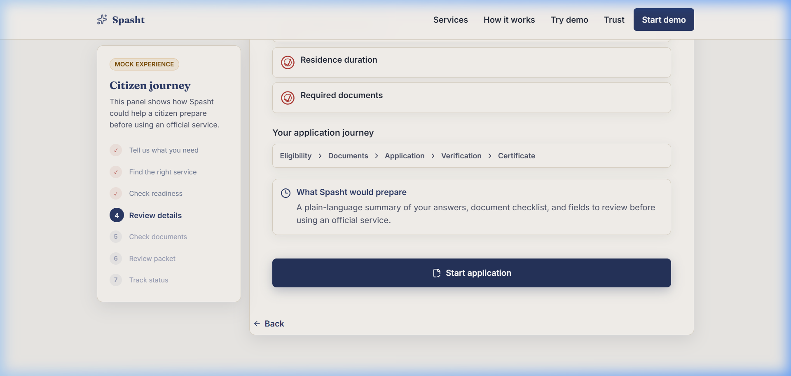

# ✨ Spasht — Clear Help for Public Service Applications

> **Spasht** (स्पष्ट) means *"clear"* in Hindi.  
> A civic-tech hackathon prototype that guides Indian citizens from a plain-language need to the right government service — no jargon, no confusion.

---



---

## 🌟 What is Spasht?

Spasht is a **mobile-first web app** that acts as a calm, plain-language civic guide. Instead of navigating complex government portals, a citizen simply describes what they need in their own words — and Spasht figures out the right service, checks if they're ready, and prepares a clean review packet before they visit an official channel like eMitra.

> **Prototype only.** Not affiliated with eMitra or any government body. No real data is submitted anywhere.

---

## 📸 Screenshots

### Landing Page


### How It Works


### Step 1 — Tell Us What You Need


### Step 2 — Service Recommendation


### Step 3 — Readiness Check


### Step 4 — You're Ready to Apply ✅


---

## 🗺️ The 7-Step Citizen Journey

| Step | Screen | What Happens |
|------|--------|-------------|
| 1 | **Tell us what you need** | Citizen describes their situation in plain language |
| 2 | **Find the right service** | Spasht identifies the correct government service and explains why |
| 3 | **Check readiness** | Mock rule check — residence duration & document checklist |
| 4 | **Review details** | Confirms the citizen meets the requirements |
| 5 | **Check documents** | Fill in mock form fields; AI checks for name mismatches |
| 6 | **Review packet** | Summary sheet with all details before the official submission |
| 7 | **Track status** | Mock application status timeline |

---

## 🤖 AI Features

- **Intent understanding** — detects vague requests and asks a clarifying question before proceeding
- **Service matching** — maps plain-language needs to the correct government service (e.g. Domicile Certificate)
- **Name mismatch detection** — Levenshtein distance check between application name and document name catches spelling differences before submission
- **Readiness check** — rule-based check for minimum residence duration and required documents
- **OpenAI fallback** — if `OPENAI_API_KEY` is set, the `/api/spasht-ai` serverless function uses GPT for real reasoning; otherwise a well-crafted local fallback handles all demo flows

---

## 🛠️ Tech Stack

| Layer | Technology |
|-------|-----------|
| Frontend | React 18 + Vite |
| Styling | Vanilla CSS (custom design system) |
| Icons | Lucide React |
| AI API | OpenAI (optional) via serverless function |
| Serverless | `api/spasht-ai.js` — works on Vercel out of the box |
| Deployment | Vercel (recommended) |

---

## 🚀 Getting Started

### Prerequisites
- Node.js 18+
- npm

### Run Locally

```bash
# Clone the repo
git clone https://github.com/Aashikhandelwal05/Spasht.git
cd Spasht

# Install dependencies
npm install

# (Optional) Add your OpenAI key for live AI
cp .env.example .env
# Edit .env and add your OPENAI_API_KEY

# Start the dev server
npm run dev
```

Open [http://localhost:5173](http://localhost:5173) in your browser.

### Environment Variables

| Variable | Required | Description |
|----------|----------|-------------|
| `OPENAI_API_KEY` | Optional | Enables live OpenAI-backed reasoning. Without it, the app runs with a built-in local fallback. |
| `SPASHT_OPENAI_MODEL` | Optional | Defaults to `gpt-5-mini` |

---

## ☁️ Deploy to Vercel

The project is structured for zero-config Vercel deployment:
- `api/spasht-ai.js` is automatically treated as a serverless function
- `dist/` (built by Vite) is served as the static frontend

### One-click deploy
[](https://vercel.com/new/clone?repository-url=https://github.com/Aashikhandelwal05/Spasht)

### Manual deploy via CLI
```bash
npm install -g vercel
vercel          # follow prompts
vercel --prod   # promote to production
```

Add your `OPENAI_API_KEY` in **Vercel Dashboard → Settings → Environment Variables** for live AI.

---

## 📁 Project Structure

```
Spasht/
├── api/
│   └── spasht-ai.js        # Vercel serverless function (re-exports handler)
├── src/
│   ├── assets/
│   │   └── civic-service-scene.svg   # Hero illustration
│   ├── main.jsx            # Full React app — all 7 journey steps
│   └── styles.css          # Complete design system (tokens, components)
├── api-spasht-ai.mjs       # Core API handler (fallback + OpenAI)
├── vite.config.js          # Vite config with dev API middleware
├── index.html
└── .env.example
```

---

## 🔒 Trust & Safety

- ⚠️ **Mock only** — No data is submitted to any government system
- 🔐 **No sensitive data** — The prototype explicitly warns users not to enter real Aadhaar, OTP, passwords, or payment information
- 🗣️ **Plain language first** — All government terms are explained in simple words
- 🏛️ **Clear limits** — Every screen is labelled as a mock/prototype so citizens know it's not an official decision

---

## 🧩 Extending Spasht

The service matching and readiness check logic is modular and easy to extend:
- Add new services in `classifyService()` in `main.jsx`
- Add new readiness rules in `checkRequirements()`
- Add new AI tasks in `api-spasht-ai.mjs` by adding new `task` handlers

---

## 📜 License

MIT — free to use, fork, and extend for civic good.

---

<p align="center">
  Made with ❤️ for the hackathon · <b>Spasht</b> — clarity for every citizen
</p>
